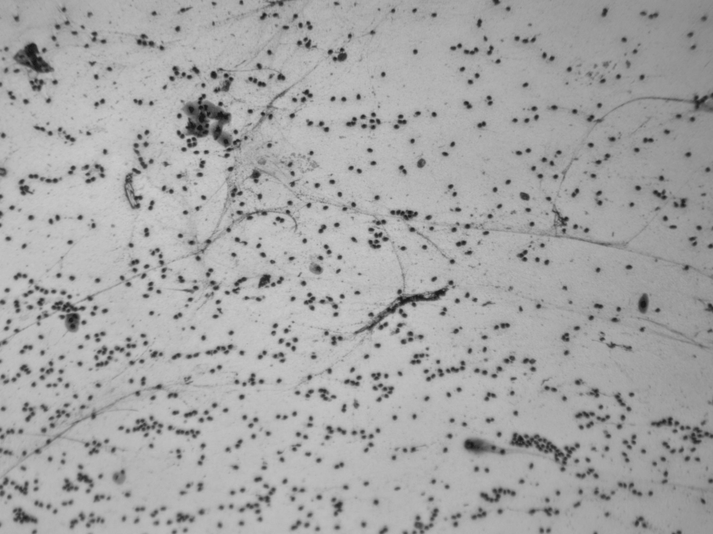

🔨 Funcionalidades do projeto :🚧 Projeto em construção 🚧

    `Pré-processamento da imagem (normalização, redimensionamento).
    `Implementação da CNN ou uso de um modelo pré-treinado.
    `Treinamento com um conjunto de imagens rotuladas.
    `Avaliação de métricas de desempenho como acurácia, F1-score, etc.

*Implementação Inicial :

CNN: Rede Neural Convolucional.

As CNNs são adequadas para o reconhecimento de padrões em imagens como a sua, que parece ser uma imagem microscópica. Elas utilizam convoluções para reduzir a dimensionalidade das imagens, mantendo informações críticas para o reconhecimento.

Transfer Learning:

Usar modelos pré-treinados como ResNet ou VGG pode ser uma ótima escolha, especialmente se o seu conjunto de dados não for muito grande. Eles já possuem camadas que capturam características gerais de imagens e podem ser ajustados para a sua tarefa específica.

        
        
        
    

pip install tensorflow pip install keras pip install numpy pip install matplotlib pip install opencv-python

│ ├── /data/ # Diretório contendo as imagens de treinamento e teste │ ├── train/ # Imagens de treinamento │ └── test/ # Imagens de teste ├── model.py # Arquivo Python contendo a definição da rede neural ├── train.py # Script para treinar a CNN ├── predict.py # Script para fazer previsões em novas imagens ├── README.md # Arquivo de documentação do projeto └── requirements.txt # Bibliotecas necessárias

