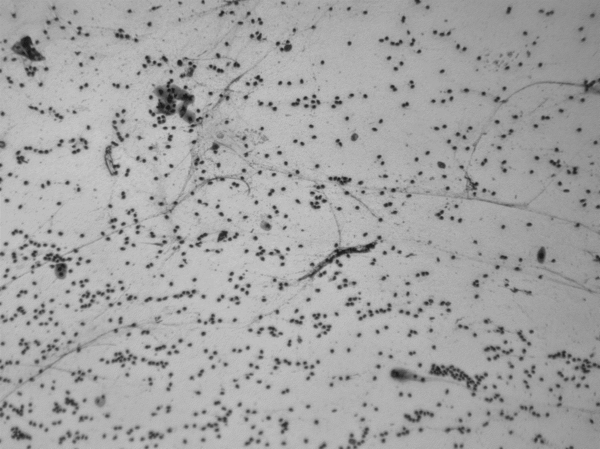

<div align="center">
  
</div>


🔨 Funcionalidades do projeto :🚧 Projeto em construção 🚧


    `Pré-processamento da imagem (normalização, redimensionamento).
    `Implementação da CNN ou uso de um modelo pré-treinado.
    `Treinamento com um conjunto de imagens rotuladas.
    `Avaliação de métricas de desempenho como acurácia, F1-score, etc.

## Implementação Inicial :

CNN: Rede Neural Convolucional.

As CNNs são adequadas para o reconhecimento de padrões em imagens como a sua, que parece ser uma imagem microscópica. Elas utilizam convoluções para reduzir a dimensionalidade das imagens, mantendo informações críticas para o reconhecimento.

```ruby
import tensorflow as tf
from tensorflow.keras import layers, models

def build_cnn(input_shape, num_classes):
    """
    Constrói uma Rede Neural Convolucional (CNN) simples.

    Args:
        input_shape (tuple): Formato da entrada (altura, largura, canais).
        num_classes (int): Número de classes de saída.

    Returns:
        model: Modelo Keras da CNN.
    """
    model = models.Sequential()

    # Camada Convolucional 1
    model.add(layers.Conv2D(32, (3, 3), activation='relu', input_shape=input_shape))
    model.add(layers.MaxPooling2D((2, 2)))

    # Camada Convolucional 2
    model.add(layers.Conv2D(64, (3, 3), activation='relu'))
    model.add(layers.MaxPooling2D((2, 2)))

    # Camada Convolucional 3
    model.add(layers.Conv2D(128, (3, 3), activation='relu'))
    model.add(layers.MaxPooling2D((2, 2)))

    # Camada Fully Connected (Densa)
    model.add(layers.Flatten())
    model.add(layers.Dense(128, activation='relu'))
    model.add(layers.Dropout(0.5))  # Dropout para evitar overfitting
    model.add(layers.Dense(num_classes, activation='softmax'))  # Saída com softmax para classificação

    # Compilar o modelo
    model.compile(optimizer='adam',
                  loss='sparse_categorical_crossentropy',
                  metrics=['accuracy'])

    return model

# Exemplo de uso
input_shape = (128, 128, 3)  # Imagens de 128x128 com 3 canais (RGB)
num_classes = 10  # Número de classes
model = build_cnn(input_shape, num_classes)
model.summary()  # Exibir resumo do modelo
```

Transfer Learning:

Usar modelos pré-treinados como ResNet ou VGG pode ser uma ótima escolha, especialmente se o seu conjunto de dados não for muito grande. Eles já possuem camadas que capturam características gerais de imagens e podem ser ajustados para a sua tarefa específica.

```ruby
import tensorflow as tf
from tensorflow.keras.applications import MobileNetV2
from tensorflow.keras import layers, models

def build_transfer_learning_model(input_shape, num_classes):
    """
    Constrói um modelo de Transfer Learning usando MobileNetV2 como base.

    Args:
        input_shape (tuple): Formato da entrada (altura, largura, canais).
        num_classes (int): Número de classes de saída.

    Returns:
        model: Modelo Keras com Transfer Learning.
    """
    # Carregar o modelo pré-treinado (MobileNetV2) sem a camada fully connected
    base_model = MobileNetV2(input_shape=input_shape, include_top=False, weights='imagenet')

    # Congelar as camadas do modelo base para evitar treinamento
    base_model.trainable = False

    # Construir o modelo completo
    model = models.Sequential()
    model.add(base_model)  # Adicionar o modelo base
    model.add(layers.GlobalAveragePooling2D())  # Pooling para reduzir dimensionalidade
    model.add(layers.Dense(128, activation='relu'))  # Camada densa adicional
    model.add(layers.Dropout(0.5))  # Dropout para evitar overfitting
    model.add(layers.Dense(num_classes, activation='softmax'))  # Camada de saída

    # Compilar o modelo
    model.compile(optimizer='adam',
                  loss='sparse_categorical_crossentropy',
                  metrics=['accuracy'])

    return model

# Exemplo de uso
input_shape = (128, 128, 3)  # Imagens de 128x128 com 3 canais (RGB)
num_classes = 10  # Número de classes
model = build_transfer_learning_model(input_shape, num_classes)
model.summary()  # Exibir resumo do modelo
```

<body>
    <div class="image-container">
        
        
        
    </div>
</body>
</html>

- Extraem características das imagens usando filtros.

### Camadas de Pooling
- Reduzem a dimensionalidade espacial, mantendo as características mais importantes.

### Camadas Densas (Fully Connected)
- Classificam as características extraídas.

### Dropout
- Evita overfitting ao desativar aleatoriamente neurônios durante o treinamento.

### Softmax
- Usado na camada de saída para classificação multiclasse.

---


## Transfer Learning

O Transfer Learning é uma técnica que utiliza modelos pré-treinados para resolver problemas específicos, economizando tempo e recursos. Abaixo estão os principais conceitos:

### Modelo Base
- Utiliza uma rede pré-treinada (ex: MobileNetV2) como extrator de características.

### Congelamento
- As camadas do modelo base são congeladas para evitar o treinamento desses pesos.

### Camadas Adicionais
- Adiciona camadas densas e de dropout para adaptar o modelo ao problema específico.

### Global Average Pooling
- Reduz a dimensionalidade das características extraídas.
```
git status
git add
git commit
```


# 🛠️ Abrir e rodar o projeto

---

### Explicação das Correções:

1. **Formatação**:
   - Usei a sintaxe Markdown para criar títulos, listas, blocos de código e estrutura de diretórios.
   - A estrutura do projeto foi formatada usando barras verticais (`│`) e traços (`─`) para melhor visualização.

2. **Instalação**:
   - Adicionei um bloco de código para instalar as dependências usando `pip`.

3. **Estrutura do Projeto**:
   - A estrutura de diretórios foi organizada de forma clara e hierárquica.

4. **Como Usar**:
   - Adicionei instruções para treinar o modelo e fazer previsões.

5. **Dependências**:
   - Incluí um comando para instalar as bibliotecas a partir do arquivo `requirements.txt`.

6. **Contribuição**:
   - Adicionei uma seção explicando como contribuir para o projeto.

7. **Licença**:
   - Adicionei uma seção sobre a licença do projeto.

---

### Como Usar:

1. Copie o conteúdo acima para o arquivo `README.md` do seu projeto.
2. Substitua os caminhos e detalhes específicos do seu projeto, se necessário.
3. Commit e push para o repositório.

---

Se precisar de mais ajustes # CHORE! 😊

### Referencias 


